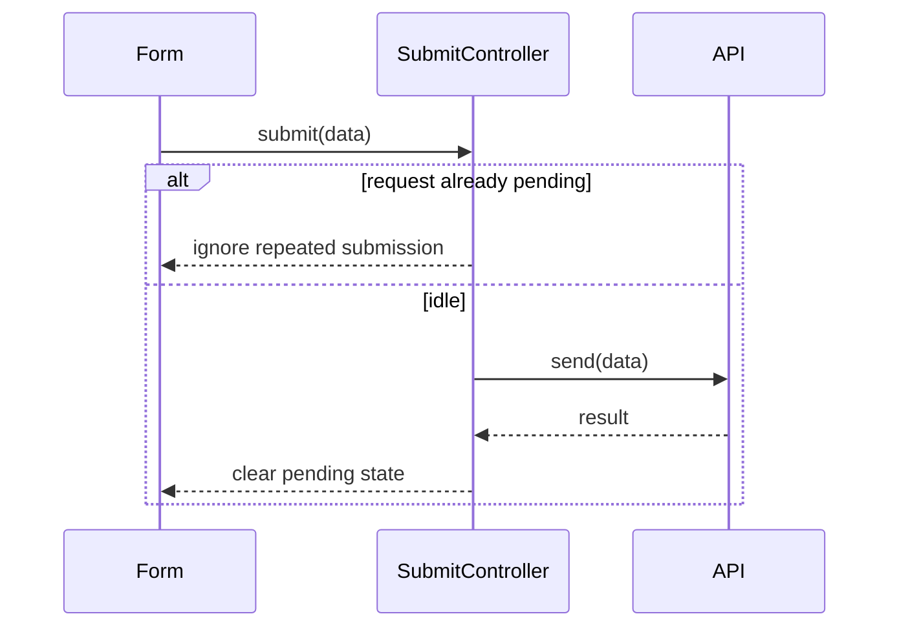

# PR Body Guidance

Choose sections for the reviewer's actual questions. Follow an existing PR template first. A small fix usually needs only a summary, a related issue when applicable, and verification.

PR titles and commit messages must follow [Conventional Commits requirements](conventional-commits.md). Keep the PR body in ordinary Markdown; it does not need a commit-message prefix.

## Summary

Explain the trigger or prior behavior, the outcome of the change, and the reason for the approach. Avoid listing edited files as the explanation.

````markdown
## Summary

Pressing Enter twice while submission is pending could create duplicate requests.
The form now ignores repeat submissions until the current request completes.

fixes #123
````

For a stacked PR, identify the parent and the scope of this PR, for example: `Stacked on #120; this PR adds cancellation to the upload flow introduced there.` Only include a commit count when verified against the selected base.

## Verification

Record exact commands, their outcomes, and what the results establish. Include relevant manual checks and material limitations. Replace all example values with actual results.

````markdown
## Verification

- `pnpm vitest run tests/submit.test.ts`: passed; covers repeated submission and retry after failure.
- `pnpm typecheck`: passed.
- Manual check: repeated Enter presses produce one request while the button shows its pending state.
- Not verified: behavior against the production service.
````

If a check fails, state the failure and whether it blocks readiness. If the failure is pre-existing, support that claim with a comparison or existing evidence. Never invent test names, counts, commands, or outcomes.

## Change Map

Use a table when several modules change or responsibility moves across a boundary. Organize rows by behavior or responsibility.

````markdown
## Change map

| Module | Before | After | Reason |
| --- | --- | --- | --- |
| `upload/client` | Returned a generic error | Preserves the server's size error | Callers can distinguish file size failures |
| `cli/upload` | Printed a generic failure | Shows a size-specific hint | Users can choose a smaller file |
````

Omit this section when the summary already explains the whole change.

## Architecture and Behavior

Use a Mermaid flow, sequence, or state diagram only when it clarifies changed ordering, module responsibilities, asynchronous work, or state transitions. Tie participants and arrows to actual symbols and code branches.

For a fix that changes a flow, a before/after pair at the same abstraction level can make the changed step easier to review. Omit diagrams for edits without meaningful flow changes.

````markdown
## Architecture and behavior


````

## Boundaries and Risks

Use this section for concrete invariants, migrations, external effects, or unresolved failure modes. Include only relevant rows and connect each protection to evidence.

````markdown
## Boundaries and risks

| Boundary | Failure mode | Protection | Evidence or gap |
| --- | --- | --- | --- |
| Pending request | Duplicate submission | Controller rejects repeated submit calls | Repeat-submission test passes |
| Failed request | Form remains disabled | Pending state clears on rejection | Error-recovery test passes |
| Server processing | Duplicate work across clients | Requires server-side idempotency | Outside this change; not verified |
````

Consider input validation, authorization, retries, concurrency, ordering, cleanup, schema compatibility, and UI loading/error states only where the diff touches them. Write `Not verified` when evidence is missing.

## Visual Changes

For user-visible UI changes, include comparable before/after images and labels. Read [Visual evidence](visual-evidence.md) for capture and upload procedures. Use uploaded URLs in a published body unless the chosen attachment tool rewrites local paths.

````markdown
## Visual changes

| Before | After |
| --- | --- |
|  |  |
| Connection settings, 1440x900, dark | Connection settings, 1440x900, dark |
````

Replace the example URLs before publication. Label a newly introduced state `Absent before` and a deleted state `Removed after` rather than inventing a counterpart screenshot.

## Rollout and Follow-up

Include required migrations, feature flags, deployment ordering, or known gaps when they affect review or release. State which gaps block merge and which are optional follow-up work. Do not invent deployment or monitoring commitments.

For a breaking change, explain the incompatible behavior, affected callers, and migration steps here or in the repository's dedicated breaking-change section. Keep this explanation consistent with the PR title's `!` and the relevant commit's breaking-change marker.

<!-- Adapted from https://github.com/antfu/skills/blob/main/skills/antfu-create-pr/references/pr-body.md -->
